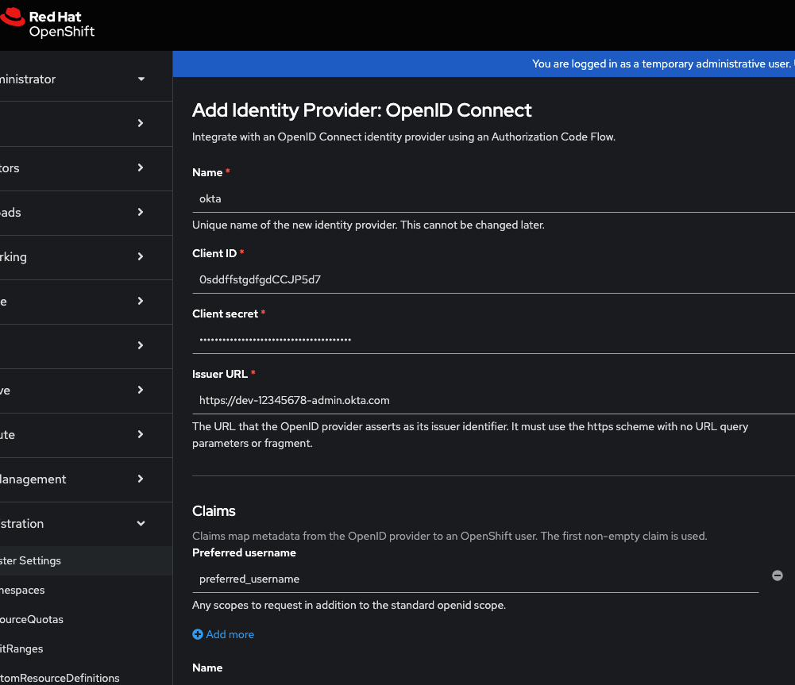

# OpenShift + Okta OAuth Integration Guide

## Overview

In order to integrate OpenShift with Okta using OAuth authentication, follow the steps outlined in this repository.

## Prerequisites

1. Ensure you have an application created on Okta.
2. OpenShift 4 SNO/CRC/Cluster should be running.
3. OpenShift should be able to reach Okta.

## Steps

1. If you do not have an Okta account and application, first create a trial account at [Okta](https://developer.okta.com/)
2. Create an application integration by navigating to:
   ```
   Applications >> Create App Integration
   ```
   
3. Create App Integration by clicking on the button.
4. Choose the sign-in method as **OIDC** and application type as **Web application**.
   
5. Specify the **Redirect URL** of OpenShift. It should look like the following. Note that `okta` at the end of the URL is the authentication source name that you'll configure in OpenShift.
   ```bash
   https://oauth-openshift.apps.url/oauth2callback/<idp-provider-name>
   ```
   
6. Copy the **Client ID** and **Client Secret** and save them securely.
   
7. Copy the **OKTA URL** from your browser's URL bar. It should look like:
   ```
   https://dev-12345678-admin.okta.com/
   ```
8. Create a user by going to:
   ```
   Directory >> People >> Add Person
   ```
   
9. Provide a username and email ID. Choose **Password** as `set by admin`, set the password, and save.
   
10. Open the OpenShift cluster console.
11. Navigate to:
    ```
    Administer >> Cluster Settings >> Configuration >> OAuth
    ```
    
12. At the bottom of the page, click:
    ```
    Add >> OpenID Connect
    ```
    
13. Enter the following details that were copied from the Okta console and submit. Also, use the same authentication source name `okta` as provided in Step 5.
    ```bash
    Client ID
    Client Secret
    Issuer URL
    ```
    
14. Wait a few minutes for the OAuth pods to restart.
15. Try logging on OCP console. When you try to reach the Console URL choose okta.
   
16. Now you will be redirected to the Okta login screen to login with user you created on Okta.
   
---

✅ You have now successfully integrated Okta with OpenShift using OAuth!
